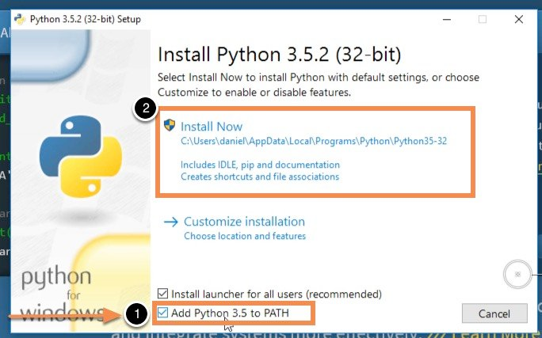
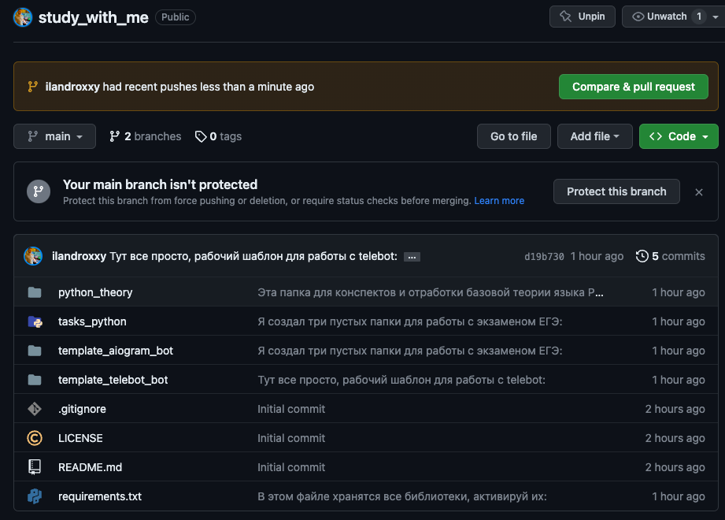
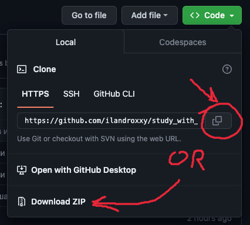

# Репозиторий для совместной подготовки к ЕГЭ по информатике (файл собран [@ilandroxy](t.me/ilandroxy) и [@f_aveN](t.me/f_aveN))
#
## [Забирайте наше учебное пособие с теорие и разборами всех номеров ЕГЭ по информатике](https://informatikakegeitpy.notion.site/tpy-e3caedb3ce0648b6b0ef1073017e3b92?pvs=4)
# 
## Прежде чем начать работу с репозиторием, предлагаю Вам скачать весь пул необходимых программ:
- ### [Python](https://www.python.org/downloads/)
- ### [PyCharm Community Edition](https://www.jetbrains.com/ru-ru/pycharm/download/?section=mac)
- ### [Git](https://git-scm.com/downloads)
- ### [Notepad++](https://notepad-plus-plus.org/downloads/), если вы надумаете работать с Git и в дальнейшем

#

## ВАЖНО: Проверяйте наличие параметра PATH при установке всех программ

# 
# 

## После утановки всех программ пришло время склонировать наш репазиторий на компьютер:

Скопируйте путь или скачайте архив с проектом

#
#

## Если получилось скопировать путь, то настало время открыть cmd (гугл в помощь) на вашем компьютере и написать первые терминальные команды:
- ### dir (для Windows) - показывает файлы в директории
- ### ls (для Linux и MacOS) - показывает файлы 
- ### cd - команда помогает попасть внутрь указанной директории (например cd PycharmProjects)

#

## После выбора удачно (любой) директории напишем команду:
- ### git clone https://github.com/ilandroxxy/study_with_me.git для клонирования репозитория на ваш локальный компьютер.

# 

## Теперь создадим виртуальное окружение venv для активации всех библиотек, для этого напишем:
## Если у вас Windows:
- ### python -m venv venv (если у вас Windows)
- ### venv\Scripts\activate (если у вас Windows)
- ### venv\Scripts\activate.bat (если у вас Windows) 
- ### venv\Scripts\Activate.ps1 (если у вас Windows)
#
## Если MacOS или Linux:
- ### pyhton3 -m venv venv
- ### source venv/bin/activate
#
## Положительный результат выглядит примерно так: 

Появилась (venv) с левого края

# 
# 
## И последняя команда, чтобы все заработало - установим библиотеки:
- ### pip install -r requirements.txt (или pip3, если у вас Linux/MacOS)

# 
# 
## Подошел к концу этот увлекательный атракцион, если у Вас возникли вопросы, то пишите мне: [@ilandroxy](t.me/ilandroxy)